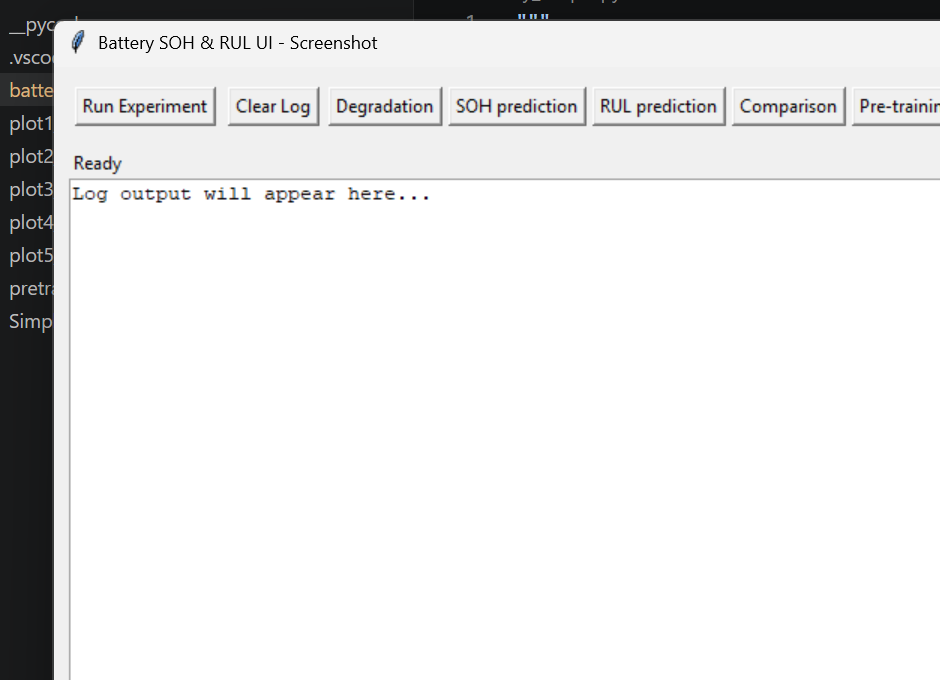

# Battery SOH & RUL Prediction Project Report

## Executive Summary

This project implements a complete battery State of Health (SOH) and Remaining Useful Life (RUL) prediction pipeline using synthetic data and a transfer learning approach. The core script, `battery_simple.py`, now includes a simple Tkinter user interface so the experiment can be launched and monitored without using the terminal.

Key deliverables:

- Full data pipeline from synthetic dataset generation to model evaluation.
- LSTM-based regression pipeline with transfer learning and baseline comparison.
- Five plots capturing degradation, SOH prediction, RUL prediction, model comparison, and training loss.
- A Tkinter UI that runs the experiment and opens plot artifacts.
- This written report with embedded screenshots and plot references.

## Background

Battery health monitoring is critical for electric vehicles, grid storage, and portable electronics. Predicting SOH and RUL helps to schedule maintenance, improve reliability, and reduce operating costs. In this project, synthetic CALCE-style battery degradation data is used to demonstrate how a transfer learning strategy can improve prediction accuracy on a target battery.

## Project Goals

The report covers:

- Synthetic data creation for a set of source and target batteries.
- Feature extraction and normalization for time-series modeling.
- LSTM model design and training with pre-training and fine-tuning phases.
- Comparison between transfer learning and scratch training.
- Visual analysis of degradation, SOH, and RUL predictions.
- An easy-to-use UI for running the pipeline.

## Data and Preprocessing

### Dataset Creation

The synthetic dataset consists of four batteries:

- `CS35`, `CS36`, `CS37`: source batteries for pre-training.
- `CS38`: target battery for fine-tuning and evaluation.

Each battery is simulated for approximately 700–760 cycles. Capacity is generated using a decaying exponential model with added Gaussian noise and two small recovery humps to reflect realistic degradation patterns.

### Label Definition

- Nominal capacity is defined as `1.1 Ah`.
- End-of-life (EoL) is defined at `0.88 Ah`, which corresponds to 80% of nominal capacity.
- SOH is computed as the ratio of measured capacity to nominal capacity.
- RUL is derived from the SOH curve as the number of remaining cycles until the EoL threshold is crossed.

### Feature Engineering

A set of five per-cycle features are synthesized from capacity and implied discharge/charge behavior:

1. Voltage mean
2. Voltage standard deviation
3. Current mean
4. CC charge time estimate
5. CV charge time estimate

These features are normalized using `MinMaxScaler`.

### Sequence Preparation

The model uses sliding windows of the last 10 cycles to predict the next SOH value. This creates a time-series dataset suitable for LSTM modeling with sequence input shape `(window, n_features)`.

## Model Architecture and Training

### LSTM Design

The model architecture includes:

- Input layer for sequences of shape `(10, 5)`.
- First LSTM layer with 64 units and `return_sequences=True`.
- Dropout at 20%.
- Second LSTM layer with 32 units.
- Another 20% dropout.
- Dense output layer producing a single SOH prediction.

### Training Strategy

The training workflow is separated into two phases:

#### Phase A: Pre-training

- Source data from `CS35`, `CS36`, and `CS37` are combined.
- The model is trained for up to 80 epochs with batch size 32.
- `EarlyStopping` is used with a patience of 10 epochs.
- The best weights are saved to `pretrained.weights.h5`.

#### Phase B: Fine-tuning

- The target battery `CS38` is fine-tuned using three different initial training splits:
  - Early adaptation: 10% of cycles.
  - Mid adaptation: 50% of cycles.
  - Late adaptation: 80% of cycles.
- Fine-tuning is performed in two stages:
  1. Freeze the first LSTM layer and train upper layers with Adam optimizer at `1e-3` for up to 60 epochs.
  2. Unfreeze all layers and continue training with a smaller learning rate `5e-4` for up to 25 epochs.
- Validation performance is monitored but training output is suppressed for cleaner UI logs.

### Baseline Comparison

A second model is trained from scratch on only 10% of `CS38` data to provide a baseline comparison. This model uses the same LSTM architecture and early stopping configuration.

## Evaluation Metrics

The models are evaluated using:

- Mean Absolute Error (MAE)
- Root Mean Squared Error (RMSE)
- Mean Absolute Percentage Error (MAPE)
- EoL prediction error in cycles

The report and plots emphasize how transfer learning can improve SOH prediction accuracy, especially when only limited target data is available.

## Results and Interpretation

### Degradation Behavior

The degradation plot shows the capacity trajectories of all four batteries. The EoL threshold at `0.88 Ah` is highlighted to illustrate when each battery reaches the end of useful life.

### SOH Prediction

The SOH prediction figure compares the true SOH curve for `CS38` against transfer-learning predictions starting from early, mid, and late adaptation points. The plot demonstrates that the model is able to follow the degradation trend even when only limited target data is available.

### RUL Prediction

The RUL plot visualizes how predicted remaining life compares with the true remaining cycles until EoL. The shaded area highlights prediction error over time.

### Model Comparison

The bar chart compares MAE for the three transfer learning splits and the scratch baseline. This makes it easy to see the advantage of transfer learning in the low-data regime.

### Training Loss

The pre-training loss curve shows the convergence of the source-model training. It includes both training and validation loss to indicate generalization during pre-training.

## User Interface

A Tkinter-based GUI has been added to simplify execution. The UI includes:

- `Run Experiment`: starts the full pipeline in a background thread.
- `Clear Log`: removes previous log messages.
- Plot buttons: open the generated PNG files directly from the application.
- Status bar and scrollable log area for progress updates.

### Screenshot



## Reproducibility

To reproduce the experiment:

1. Open a terminal in `c:/Users/Saransh/Downloads/files1`.
2. Run:

```bash
python battery_simple.py
```

3. Use the UI to start the pipeline.
4. Once complete, open the generated plots with the provided buttons.

The environment uses a fixed NumPy and TensorFlow random seed to improve reproducibility.

## Limitations

This project uses synthetic battery data rather than real measurement records. Consequently:

- The feature set is illustrative rather than derived from actual cell voltage/current charging curves.
- The model has not been validated against real-world battery chemistries.
- Further tuning would be required for deployment-level accuracy.

## Future Work

Potential improvements include:

- Replacing synthetic data with real CALCE CSV data.
- Adding more realistic feature extraction from actual charge/discharge curves.
- Testing additional transfer learning strategies and alternative model architectures.
- Comparing LSTM performance with transformer or convolutional time-series models.
- Adding an export option for results and metrics.

## File Summary

- `battery_simple.py`: core script with GUI, data pipeline, model training, evaluation, and plot generation.
- `generate_pdf_report.py`: generator script used to convert this markdown report into a PDF.
- `battery_project_report.md`: this extended project report.
- `battery_project_report.pdf`: the generated PDF version of this report.
- `battery_ui_screenshot.png`: screenshot of the Tkinter interface.
- `plot1_degradation.png`, `plot2_soh.png`, `plot3_rul.png`, `plot4_comparison.png`, `plot5_loss.png`: evaluation visualizations.
- `pretrained.weights.h5`: saved weights from the pre-training phase.

---

Report generated from the current project state on April 23, 2026.
